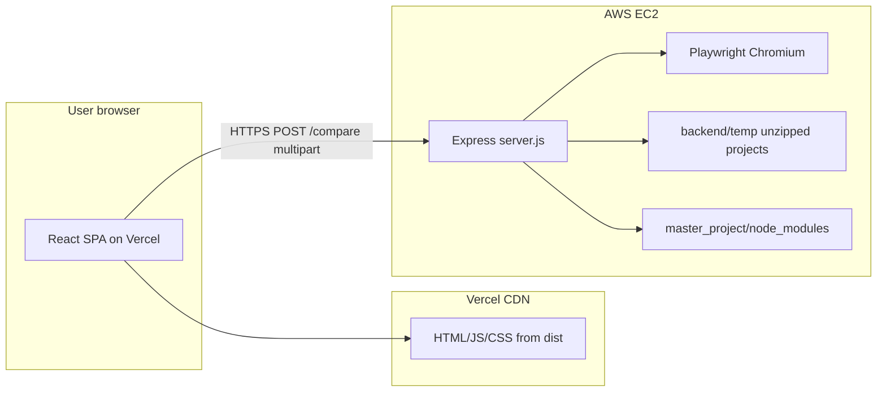

# Deployment deep dive: architecture, security, and why steps are manual

This document explains **how** the Visual UI Checker is wired when you split **frontend (Vercel)** and **backend (EC2)**, **why** each configuration exists, and **what cannot be automated** from a generic assistant environment.

Pair with the procedural guide: **[DEPLOYMENT.md](./DEPLOYMENT.md)**.

---

## 1. High-level architecture



- **Browser** loads the UI from **Vercel** (same **origin** as the SPA: e.g. `https://my-app.vercel.app`).
- The UI calls **your API** on **EC2** at whatever you put in **`VITE_API_URL`** — that is a **different origin** (different host, scheme, or port), so the browser applies **CORS** rules.
- **EC2** runs **Node + Express**, **Playwright**, unzips uploads under **`backend/temp`**, and (for Vite student/solution apps) uses **junction/symlink** from each temp project’s `node_modules` to **`backend/master_project/node_modules`**.

---

## 2. Origins, same-origin policy, and CORS

### 2.1 What is an “origin”?

An **origin** is:

`scheme` + `host` + `port` (if non-default)

Examples:

| URL | Origin |
|-----|--------|
| `https://foo.vercel.app/` | `https://foo.vercel.app` |
| `https://foo.vercel.app/about` | `https://foo.vercel.app` |
| `http://localhost:5173/` | `http://localhost:5173` |
| `http://13.202.45.132:3000` | `http://13.202.45.132:3000` |

Trailing paths **do not** change the origin. **`http` vs `https`** is a different origin.

### 2.2 Same-origin policy

By default, **JavaScript in a page** may only read responses from **the same origin** as the page, unless the **other server** explicitly allows your page’s origin via **CORS**.

Your frontend does:

```http
POST https://api.example.com/compare
Content-Type: multipart/form-data
Origin: https://my-app.vercel.app
```

The browser sends **`Origin`** so the API can decide whether to allow the response to be read by your script.

### 2.3 How your backend implements CORS

In `server.js`, allowed origins come from **`CORS_ORIGINS`** (comma-separated). The server checks the request’s **`Origin`** header against that list. If it does not match, the browser blocks the frontend from reading the response (you typically see a CORS error in DevTools → Network/Console).

**Implications:**

- You must list the **exact** frontend origin(s), e.g. `https://my-app.vercel.app` — not `https://my-app.vercel.app/` with a trailing slash in the env list (usually you omit path entirely; origins do not include trailing slash).
- **Preview deployments** on Vercel get **different** hostnames (`*.vercel.app` random suffix). If you use Preview URLs, add each pattern or use a **wildcard-capable** setup (your current code uses **explicit** origins only — simplest is to add each preview URL when testing, or only allow Production URL).
- **`http://localhost:5173`** is needed if you ever run the Vite dev server locally against the **remote** API (and you add that origin on the server’s `CORS_ORIGINS`).

### 2.4 Preflight (OPTIONS)

For some requests (e.g. certain headers or methods), the browser sends an **`OPTIONS`** preflight. Your server enables CORS middleware and `OPTIONS` handling so preflight succeeds **only** for allowed origins. If `CORS_ORIGINS` is wrong, preflight fails and the real `POST` never runs as far as your JS is concerned.

---

## 3. `VITE_API_URL` (frontend) — build-time vs runtime

### 3.1 Vite’s `import.meta.env.VITE_*`

Vite **inlines** `import.meta.env.VITE_API_URL` at **build time** into the JS bundle.

- **Locally:** `frontend/.env` provides `VITE_API_URL` when you run `npm run dev` or `npm run build`.
- **On Vercel:** you set **`VITE_API_URL`** in the project **Environment Variables** UI. Vercel injects it during **`npm run build`**. The built `dist` assets contain the **literal string** of your API base URL.

**Important:** Changing `VITE_API_URL` in Vercel **does not** change already-deployed JS until you **redeploy** (new build).

### 3.2 No trailing slash

Your frontend code typically does `` `${baseUrl}/compare` `` after stripping one trailing slash. If `baseUrl` is wrong (double slash or missing slash), you can get bad URLs. Convention: store **`https://api.example.com`** without trailing slash.

### 3.3 Mixed content (HTTPS frontend calling HTTP API)

If the SPA is served over **`https://`** (Vercel production) and **`VITE_API_URL`** is **`http://`** raw IP, some browsers or corporate policies may block or warn (**mixed content**) when upgrading security. **Best practice:** put **HTTPS** in front of the API (Nginx + Let’s Encrypt on EC2, or ALB with TLS) and set `VITE_API_URL` to `https://...`.

---

## 4. `PORT` and `CORS_ORIGINS` (backend) — runtime only

Express reads **`PORT`** from `process.env` when `server.js` starts (default 3000). **`CORS_ORIGINS`** is read at startup into `ALLOWED_ORIGINS`.

Changing **`backend/.env`** on EC2 requires **restarting** the Node process (**`pm2 restart ...`**) so new values load.

There is **no** need to put `VITE_*` in the backend `.env`; the backend does not serve the Vite-built SPA in production (Vercel does).

---

## 5. EC2 deep dive

### 5.1 What runs on the instance

- **Node** runs `server.js` (long-lived).
- For each compare job, child processes may run **`npm run dev`** / **Vite** / **CRA** inside **`backend/temp/<runId>/...`** — those are **separate** OS processes, not “inside” Express’s memory only.
- **Playwright** launches **Chromium**; that needs **CPU, RAM, and Linux libraries** (`playwright install --with-deps` installs many of them on Ubuntu).

### 5.2 Why `t3.small` or larger is often recommended

- Chromium + multiple Node dev servers is **RAM-heavy**.
- **`t3.micro`** can work for light demos but OOM-kills or slow runs are common under parallel load.

### 5.3 Security groups

- **Inbound 22:** SSH — restrict to **your IP**, not `0.0.0.0/0`, when possible.
- **Inbound 3000:** only if you expose the API directly. Prefer later: **443 only** with Nginx proxying to `127.0.0.1:3000` so Node is not world-exposed on a plain HTTP port.

### 5.4 PM2

**PM2** keeps `node server.js` alive across SSH disconnects and reboots (after `pm2 startup`). It is **not** the only option — **systemd** user services are an alternative — but PM2 is quick for Node operators.

### 5.5 Disk and `backend/temp`

Uploads and extracted ZIPs live under **`backend/temp`**. Long runs or failed cleanups can fill disk. The code attempts cleanup after runs; still monitor **`df -h`** on small volumes.

### 5.6 `master_project` and junctions (Windows vs Linux)

The backend tries to link each temp React project’s **`node_modules`** to **`backend/master_project/node_modules`** for speed.

- **Linux (EC2):** symlinks/junctions generally work if **`master_project/node_modules`** exists and is fully installed.
- **Windows + OneDrive:** junction creation or synced `node_modules` can fail (`ENOENT`), which breaks Vite resolution — you saw **`@vitejs/plugin-react`** missing when the link target was absent. **Mitigation:** full `npm install` in **`backend/master_project`**, and avoid fragile sync paths if possible.

---

## 6. Vercel deep dive

### 6.1 Monorepo root

Vercel must use **`frontend`** as the **Root Directory** so `npm run build` runs where **`package.json`** for the SPA lives. If root is the repo top level, the build will fail or build the wrong thing.

### 6.2 Environment scopes

Vercel can set variables for **Production**, **Preview**, and **Development**. `VITE_API_URL` usually needs at least **Production**; add **Preview** if preview deployments should hit a real API (often a staging API URL).

### 6.3 Cold starts

**Not** serverless functions for your API — your API is on **EC2**. Vercel only serves **static** assets. “Cold start” is mostly irrelevant for the API; EC2 VM is either running or stopped.

---

## 7. End-to-end request path for `/compare`

1. User selects ZIPs in the browser (origin = Vercel).
2. Frontend builds **`FormData`** and **`fetch(`${VITE_API_URL}/compare`, { method: 'POST', body: formData })`**.
3. Browser sends **`Origin: https://...vercel.app`**.
4. EC2 Express receives POST; CORS middleware checks **`Origin`** against **`CORS_ORIGINS`**.
5. If allowed, server streams **NDJSON** progress, runs Playwright, returns final **`result`** line.
6. Browser streams body; frontend parses lines and updates UI.

If step 4 fails configuration, step 5 never successfully returns data to your script — you see network/CORS errors.

---

## 8. Why AWS and Vercel steps cannot be done “for you” by an assistant

| Barrier | Explanation |
|---------|-------------|
| **Identity** | AWS and Vercel actions are tied to **your** identity (MFA, billing, legal responsibility). |
| **Secrets** | SSH keys, AWS access keys, and session tokens must not be pasted into chat. |
| **Network boundary** | Provisioning a VM or CDN edge happens on **vendor control planes** reachable only with **your** authenticated session. |
| **Uniqueness** | IPs, hostnames, and security posture differ per account; there is no single global “deploy button” the agent can press for your project. |

What **can** be automated locally: dependency installs, `.env` scaffolding, scripts (`deploy/preflight.ps1`, `deploy/ec2-bootstrap.sh`), and documentation — which this repo already includes.

---

## 9. Hardening checklist (production-minded)

- [ ] TLS on API (`https://`) and `VITE_API_URL` using HTTPS.
- [ ] Restrict **SSH** to your IP; rotate keys periodically.
- [ ] Do not expose **port 3000** publicly longer than needed; prefer reverse proxy + firewall to localhost-only Node.
- [ ] Rate limiting / auth for **`POST /compare`** if the API is public (currently it is **unauthenticated** — anyone who can reach it can POST large uploads).
- [ ] Monitor disk and **`pm2 logs`** for OOM or Playwright crashes.

---

## 10. Debugging map

| Symptom | Likely layer | What to verify |
|---------|----------------|----------------|
| Browser: CORS policy blocked | CORS | `CORS_ORIGINS` includes exact Vercel origin; restart PM2. |
| Failed to fetch | DNS / SG / TLS | EC2 IP/DNS reachable from your network; port open; mixed content if https→http blocked. |
| 404 on `/compare` | URL | `VITE_API_URL` has no typo; should not end with `/compare` twice. |
| Vite ERR_MODULE_NOT_FOUND on server | master_project | On EC2: `ls backend/master_project/node_modules/@vitejs/plugin-react`; run `npm install` in `master_project`. |
| Stream ends with no results | Frontend parser / network | Backend logs; browser Network tab for chunked response. |

---

## 11. Glossary

| Term | Meaning |
|------|---------|
| **Origin** | Scheme + host + port of a site; basis of same-origin policy. |
| **CORS** | Mechanism for a **different** origin’s API to opt in to browser reads. |
| **`VITE_API_URL`** | Build-time config for where the SPA sends API requests. |
| **`CORS_ORIGINS`** | Runtime allowlist of browser origins for the API. |
| **PM2** | Process manager for Node on Linux. |
| **Junction / symlink** | `node_modules` shortcut from temp project to shared `master_project` deps. |

---

For the ordered checklist and commands, use **[DEPLOYMENT.md](./DEPLOYMENT.md)**.
